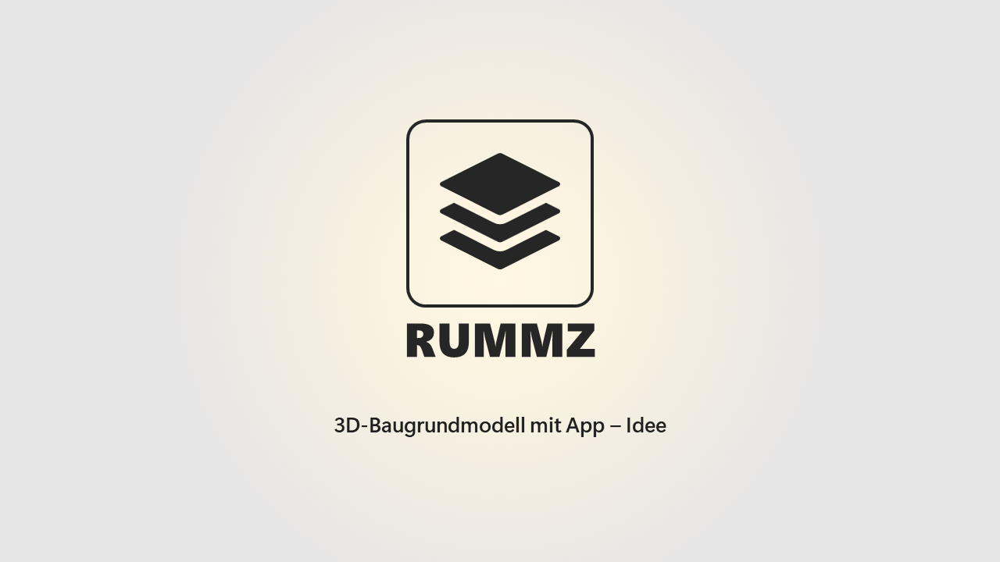
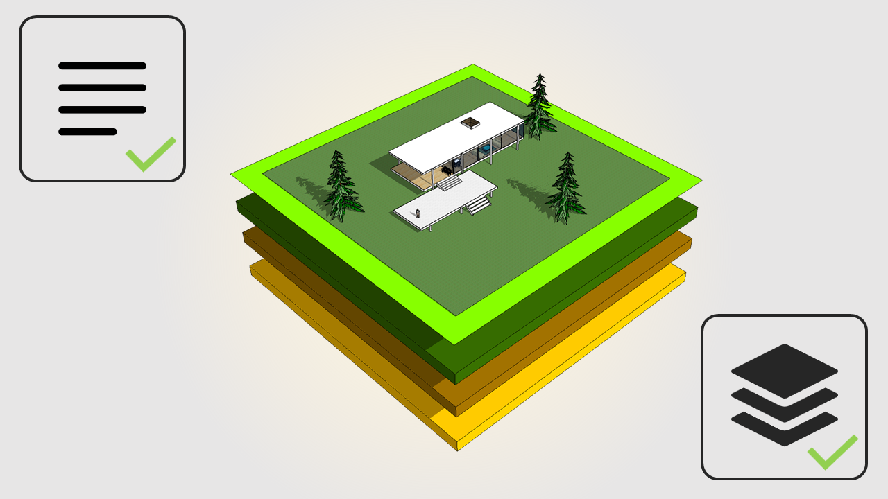
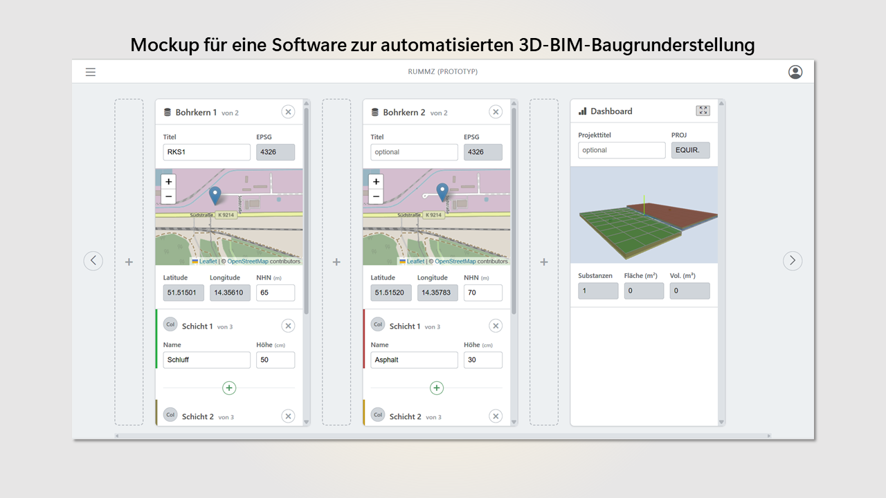
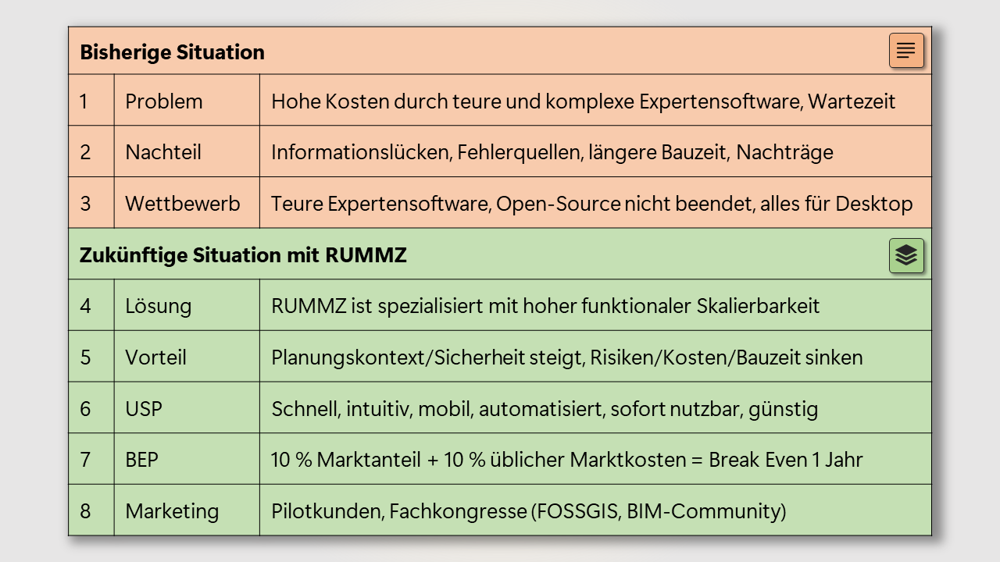

# APPLICATION FOR PROTOTYPE FUND

## 1. Allgemeines

### Projekttitel *

RUMMZ

## 2. Dein Projekt

### Beschreibe dein Projekt kurz. *

RUMMZ (Rapide Untergrund Material Modellierung und Zonierung) ist eine smarte Single-Page-Webanwendung (SPA) mit dem Ziel, die digitale Souveränität der kommunalen Verwaltungen im Bereich der Baugrunduntersuchung zu stärken. Ab 2026 muss mit der DIN-Methode Building Information Modelling (BIM) öffentliche Infrastruktur geplant werden. Alle Bauinformationen sind dann in dem ISO-Format Industry Foundation Classes (IFC) in einem zentralen 3D-Datenmodell gespeichert. RUMMZ ermöglicht die selbstständige, zeitsparende und normgerechte Umwandlung von geotechnischen Baugrundinformationen in dieses Format. Die Anwendung fördert damit die Einhaltung gesetzlicher Vorgaben zur Baubeschleunigung und sparsamen Mittelverwendung von Geldern sowie Flächen und reduziert die Abhängigkeit von proprietärer Software bei erhöhter IT- sowie Datensicherheit.

### Welche gesellschaftliche Herausforderung willst du mit dem Projekt angehen? *

Die Bauzeitverzögerungen und Preisexplosionen bei Stuttgart 21 und BER veranlassten den Gesetzgeber die Art und Weise der Planung von Grund auf zu ändern. RUMMZ hilft den Kommunen bei dieser digitalen Transformation vom "Aktenordner zum Datenmodell" und entlastet gleichzeitig die kommunalen Rechenzentren. 

Bodeninformationen für Baugenehmigungen können selbstständig und mit Selbstwirksamkeit von Sachbearbeiter*innen ohne Schulung gesetzeskonform und digital souverän gemäß den 2026 geltenden BIM-Vorschriften umgesetzt werden. In Deutschland werden jährlich ca. 200 TSD Baugrundgutachten (siehe Statista Anzahl Baugenehmigungen für Neubauten 2024) erstellt, die nur durch kostenverursachende Auftragsvergaben BIM-konform digitalisiert werden können. Je nach Umfang müssen Ausschreibungen erfolgen und Fristen gewahrt werden, was mehrere Monate Bearbeitungsdauer bedeutet und Ressourcen bindet. Auch freie Software wie QGIS kann diese Lücke nicht schließen.

RUMMZ ist ein einfach zu verstehendes und intuitiv zu bedienendes Online-Tool. Die Baugrundinformationen aus den gesetzlich vorgeschriebenen Baugrundgutachten werden in das geforderte IFC-Format sicher und schnell exportiert, was Verwaltungen entlastet sowie unabhängiger macht im Umgang mit Flächenversiegelungen. RUMMZ unterstützt den offenen IFC-Standard und stärkt die digitale Selbstbestimmung öffentlicher Akteure für eine schnellere, transparentere und ressourcenschonende Infrastrukturplanung.

### Wie willst du dein Projekt technisch umsetzen? *

RUMMZ wird als Single-Page-Webanwendung (SPA) entwickelt. Es ist keinerlei Installation notwendig, was die IT-Sicherheit erhöht und kommunale Rechenzentren entlastet. RUMMZ wird vollständig lokal im Browser-Cache mit minimalen Vorgaben an die Client-Hardware ausgeführt. In diesem offenen Architekturkonzept werden keine Daten extern gespeichert (DSGVO-konform). Die Domain rummz.de ist bereits reserviert und wird mit dem öffentlichen Repository https://github.com/stefanstoehr/rummz verknüpft für kollaboratives Coding.

RUMMZ basiert vor allem auf nativem JavaScript für kompilierungsfreie Browser-Ladezeiten, sofortige DOM-Aktualisierungen und performante 3D-Visualisierungen. Benutzer*innen erleben das Interface als übersichtlich, intuitiv und modern. Für Design, Karten, Geodatenverarbeitung und Volumenmodellierung werden etablierte Open-Source-Bibliotheken wie Leaflet.js, Three.js, Proj4.js, Bootstrap.js, Chart.js und Ifc.js eingebunden. Die Eingabeinformationen (Bohrkoordinaten, Höhe, Schichten, Farbcodes) werden als (1) JSON-Datei heruntergeladen, um sie für die nächste Session zu importieren, oder als (2) IFC-Datei heruntergeladen, um die vorgegebene Weiternutzung z.B. in der CDE zu ermöglichen.

Das MVP verzichtet bewusst auf komplexe Frameworks, bleibt aber skalierbar für spätere Erweiterungen – etwa durch eine Python-Microservice-Schicht für individuelle geotechnische Interpolationen oder ein skalierbares Frontend-Backend-Setup bevorzugt mit Next.js und Node.js, um Usability und Funktionsumfang zu erweitern.

### Hast du schon an der Idee gearbeitet? Wenn ja, beschreibe kurz den aktuellen Stand und erkläre die geplanten Neuerungen. *

Ja, es liegt bereits ein detailliertes UI-Konzept mit interaktivem Mockups vor. Die Benutzeroberfläche ist als klickbares Designmodell umgesetzt und zeigt exemplarisch, wie die Eingabe, Visualisierung und Auswertung der Bodendaten funktionieren.

Die technische Architektur mit Event-Delegation, Event-Handlers, DOM-Änderungen und dem SSOT-Datenmodell ist skizziert, ebenso die Algorithmen für die dynamische Visualisierung und Aktualisierung der 3D-Modelle (Bohrzylinder als auch Expansionsvolumen) aus den Nutzereingaben.

Die Förderung soll nun die separierten Entwicklungen zu einem funktionalen Prototypen (MVP) vereinen, mit u.a. der Anbindung an Echtzeit-Auswertungen im Dashboard mit Chart.js, Möglichkeiten zur Konfiguration z.B. Veränderung der Volumenexpansion und den Export in das offene BIM-Format IFC.

### Welche ähnlichen Ansätze gibt es schon und was wird dein Projekt anders bzw. besser machen? *

RUMMZ besitzt als smartes und mobiles Browserinterface mit der spezialisierten Aufgabe der Baugrunderstellung im IFC-Format ein Alleinstellungsmerkmal.  Quelloffene Desktop-Software wie QGIS oder Blender verfügen über BIM-Plugins, jedoch nicht über die entsprechenden Formulare für die Nutzereingaben und sind darüber hinaus sehr komplex in ihrer Bedienung. Das Gleiche gilt für proprietäre Software wie GEOgraf, GGU oder Autodesk, die teuer sind, CAD-Hardware und Installationen voraussetzen. RUMMZ rendert im Browser über WebGL, exportiert die Daten nach IFC für die Weiternutzung als u.a. Import in das Common Data Environment (CDE) ohne Installation, ohne externe Datenspeicherung und somit vollständig konform mit der DSGVO.

### Wer ist die Zielgruppe und wie soll dein Projekt sie erreichen? *

Die Hauptzielgruppe von RUMMZ sind kommunale Bauverwaltungen, die einen kostengünstigen, sicheren und einfachen Weg suchen, BIM-konform zu planen. Eine klar strukturierte und gut lesbare Benutzeroberfläche ermöglicht die sofortige Visualisierung des 3D-Baugrundmodells und den direkten Download im IFC-Format – ein hoher Alltagsnutzen für die Planungspraxis.

Zusätzlich bietet das Dashboard eine dynamische Auswertung der Bodeninformationen, die Nutzer*innen unmittelbar Erkenntnisse und Entscheidungsgrundlagen liefert. Auch Umweltinstitutionen, Bauberufe und der Immobiliensektor profitieren von der Möglichkeit, die endliche Ressource Boden auszuwerten.

Für die initiale Verbreitung werden zwei bis vier Pilotkunden aus Bauverwaltungen und Bauunternehmen als Multiplikatoren in ihrem Netzwerk wirken, neben der Open-BIM- und OSM-Community (FOSSGIS).

### Skizziere kurz die wichtigsten Meilensteine, die im Förderzeitraum umgesetzt werden sollen. *

Benutzerschnittstelle: Die Logik und das Layout ist mit grundlegenden UI-Elementen wie Input-Elementen, Event-Listeners/-Handlers,  (Scroll-)Buttons, Icons und einem informativen Guide- sowie Dashboard-Bereich ausgestattet.

2D-Kartenschnittstelle: Die Implementierung der OSM-Maps zur Erstellung von Geodatenpunkte ist eingefügt. Die Koordinaten der Marker werden bei jeder Interaktion in Echtzeit aktualisiert.

3D-Visualisierung: Für die Umrechnung der kartesischen Koordinaten in die 3D-Szene wird eine "Equirectangular Approximation" verwendet. Die Positionierung der Zylindergeometrien (Bohrkerne) ist exakt. Die Volumengeometrien (Ausbreitungsflächen) sind lagegenau durch Triangulation und Voronois-Berechnungen platziert.

Dashboard: Diagramme für z.B. Materialvergleiche heben den Nutzwert sofort.  

Export: Der JSON- und IFC-Export per Klick machen die App zum vollständigen MVP.

### An welchen Software-Projekten hast du / habt ihr bisher gearbeitet? Bei Open-Source-Projekten bitte einen Link zum Repository angeben.

05/2025 bis 07/2025 habe ich für den Lehrstuhl Produktionswirtschaft der Universität in Cottbus ein interaktives Dashboard für die Ansicht von Ist- und Soll-Signalen (Wifi) für Desktop und mobile Endgeräte mit QGIS und Three.js als 3D-Anwendung programmiert. Siehe Link: https://github.com/prodwilab
12/2024 bis 05/2025 konnte ich für die A+S Consult GmbH aus Dresden eine kommerzielle 3D IFC-React-App programmieren. Funktionen die auch bei RUMMZ vorkommen sind Formularverarbeitung, 3D IFC-Viewer, Kartenanbindung und Projektion.
02/2022 bis 06/2022 habe ich für das Stadtplanungsamt in Cottbus eine interaktive Karten-App mit QGIS, Leaflet.js, Tooltips und Geolokalisierung erstellt. Link: https://github.com/stadtentwicklung  

### Erfahrung, Hintergrund, Motivation, Perspektive: Was sollen wir über dich (bzw. euch) wissen und bei der Auswahl berücksichtigen?

RUMMZ vereint moderne Open-Source-Webtechnologien wie 3D- und Datenvisualisierungen mit dem offenen international etablierten IFC-Exportformat für die Infrastrukturplanung. Seit 2012 habe ich mir autodidaktisch die notwendigen Coding-Skills erarbeitet und bin so in der Lage mit meiner Anwendersicht das fehlende Werkzeug selber zu erstellen. RUMMZ stärkt auch die FOSSGIS-Community, von der ich als Vereinsmitglied bereits seit Jahren profitiere. Als zertifizierter BIM-Manager bin ich überzeugt vom Mehrwert dieser GIS-/BIM-App für die öffentlichen Bauverwaltungen, in der ich 7 Jahre lang tätig war, und sehe den Prototypen als Grundstein für spätere Erweiterungen mit Kennwerten, (Orthofoto-)Kartendiensten, EPSG-Koordinatensystemen, Projektionsverfahren, Geländeoberflächenverschneidungen und Rendering-Methoden.
